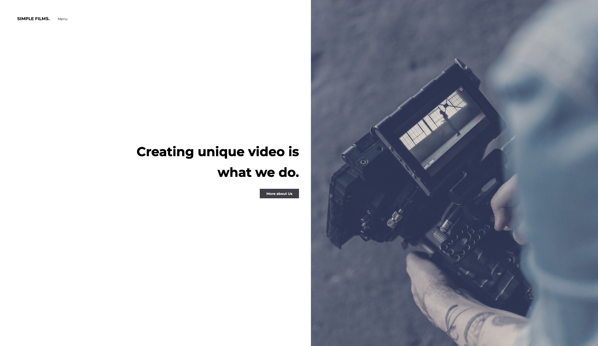

<h1 align="center">
  SimpleFilms.no in Gatsby.js and gsap
</h1>

## !important STILL IN PROGRESS

<h2 align="center">
  
</h2>

## Project Specifications

New version of simplefilms.no 

## Step by step building process:

## TODO LIST
### sleep - eat - code -repeat
 - [X] create gatsby skeleton
 - [X] create header and menu
 - [X] create footer component
 - [X] create prices page
 - [X] create price component
 - [] media query price plan
 - [] create blog page
 - [X] global layout
 - [X] styling front page and menu
 - [X] animation in gsap for menu
 - [X] animation in gsap for frontPage
 - [X] create about me page
 - [X] animation in gsap for About Me
 - [X] f#&%k that
 - [X] global animation
 - [] GraphQL for images
 - [] MDX and global post
 - [] create the foundation of a blog
 - [] headleess CMS blog
 - [] Gatsby Node API
 - [] DatoCMS
 - [] connecting DatoCMS and Gatsby
 - [] media query
 - [] tests
 - [] deploy

